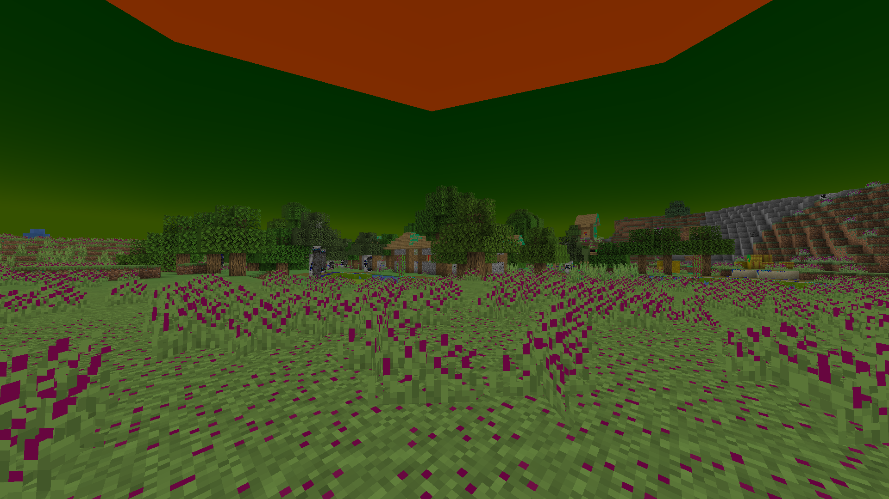
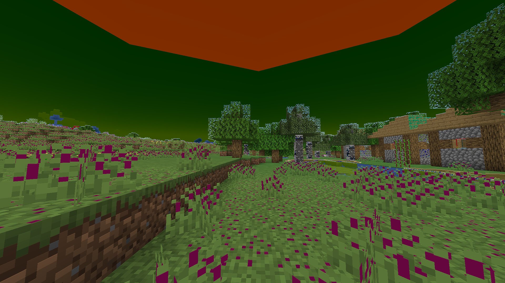
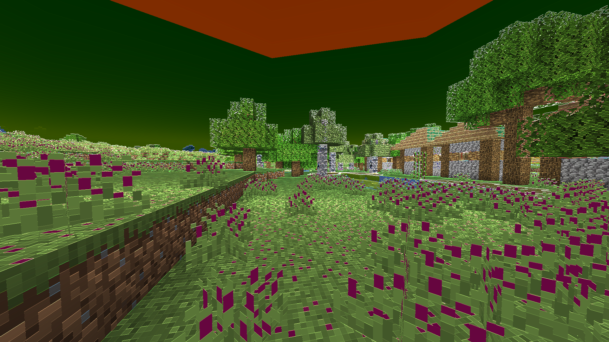
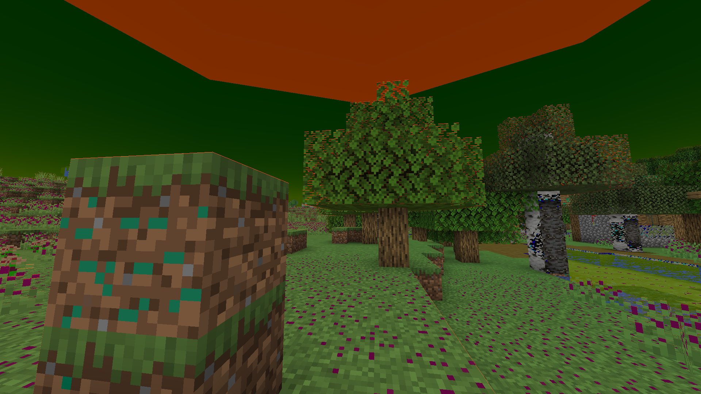
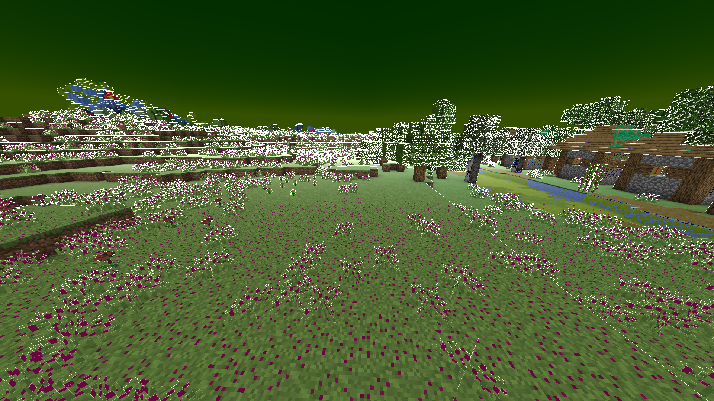
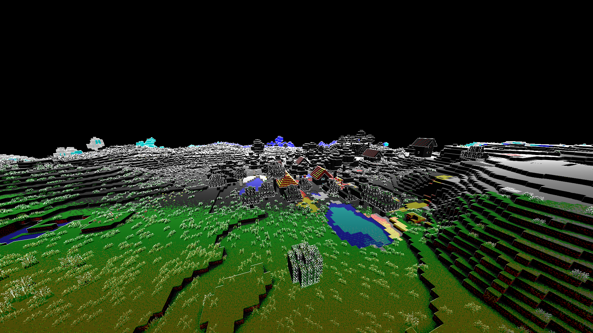

# Writing Shader Code

First things first, lets set up our shaders.json

```json
assets/souper_secret_settings/shaders.json
{
    "namespaces": [
        {
            "replace": false,
            "namespace": "tutorial_shader",
            "shaders": [
                "simulation",
                "example_post"
            ]
        }
    ]
}
```

Since we are using the same namespace, it's easy to add onto our shaders.json from the [last section](AddingShaders.md)

And we can get our post shader ready as well - Since we will be dealing with a lot more files im naming all my files `example_<type>` to make it clear what points where, but this is not necessary, minecraft and my own expanded_shaders would just keep everything named `example`

```json
assets/tutorial_shader/shaders/post/example_post.json
{
    "targets": [
        "0"
    ],
    "passes": [
        {
            "name": "blit",
            "intarget": "minecraft:main",
            "outtarget": "0"
        },
        {
            "name": "blit",
            "intarget": "0",
            "outtarget": "minecraft:main"
        }
    ]
}
```

We have already learnt that the "name" field points to `minecraft/shaders/program/<name>.json`, and while we can create a new file in minecraft/shaders/program and reference it the same way, Souper Secret Settings allows for namespaces, so lets use that

```
TutorialShader
├── assets
│   ├── souper_secret_settings
│   │   └── shaders.json
│   └── tutorial_shader
│       └── shaders
|           ├── post
|           |   └── *example_post.json*
|           └── program
|               └── *example_program.json*
├── pack.mcmeta
└── pack.png
```

```json
assets/tutorial_shader/shaders/post/example_post.json
{
    "targets": [
        "0"
    ],
    "passes": [
        {
            "name": "tutorial_shader:example_program",
            "intarget": "minecraft:main",
            "outtarget": "0"
        },
        {
            "name": "blit",
            "intarget": "0",
            "outtarget": "minecraft:main"
        }
    ]
}
```

Let's go ahead and copy one of minecraft's shader programs into our example program, I'll use blur since we are already somewhat familiar with it, and it will help explain how to use uniforms later on

```json
assets/tutorial_shader/shaders/program/example_program.json
{
    "blend": {
        "func": "add",
        "srcrgb": "one",
        "dstrgb": "zero"
    },
    "vertex": "sobel",
    "fragment": "blur",
    "attributes": [ "Position" ],
    "samplers": [
        { "name": "DiffuseSampler" }
    ],
    "uniforms": [
        { "name": "ProjMat",     "type": "matrix4x4", "count": 16, "values": [ 1.0, 0.0, 0.0, 0.0, 0.0, 1.0, 0.0, 0.0, 0.0, 0.0, 1.0, 0.0, 0.0, 0.0, 0.0, 1.0 ] },
        { "name": "InSize",      "type": "float",     "count": 2,  "values": [ 1.0, 1.0 ] },
        { "name": "OutSize",     "type": "float",     "count": 2,  "values": [ 1.0, 1.0 ] },
        { "name": "BlurDir",     "type": "float",     "count": 2,  "values": [ 1.0, 1.0 ] },
        { "name": "Radius",      "type": "float",     "count": 1,  "values": [ 5.0 ] }
    ]
}
```

Now that this is copied in, the shader does work, and it blurs the screen diagonally a small amount - which is to be expected, as the default BlurDir is [1.0, 1.0], and the radius is 5.0, but that's besides the point, lets see what each part of this json is doing

```json
"blend": {
    "func": "add",
    "srcrgb": "one",
    "dstrgb": "zero"
}
```

The first section is called blend, there isn't much of a reason to touch it, so let's ignore it and move on

```json
"vertex": "sobel",
"fragment": "blur",
```

Ok, these are useful, the "vertex" field tells the program what vertex shader to use, so in this case it points to `minecraft/shaders/program/sobel.vsh` (.vsh meaning vertex shader)
The "fragment" field tells the program what fragment shader to use, in this case that's `minecraft/shaders/program/blur.fsh` (.fsh meaning fragment shader)

As with the program reference in the post shader, Souper Secret Settings allows us to namespace these, so `"fragment": "tutorial_shader:example_fragment"` would point to `assets/tutorial_shader/shaders/example_fragment.fsh`

Most of vanilla's shaders use the vertex shader "sobel", which is used by the sobel shader program, but isn't overly related to the sobel effect

```json
"attributes": [ "Position" ],
```

This never changes between shaders, and I cant figure out any other attributes, so we can ignore it as well - it seems to be used by vertex shaders to get the positions of the vertices

```json
"samplers": [
    { "name": "DiffuseSampler" }
],
```

We've already seen how samplers work, there's a list of samplers, DiffuseSampler is the main intarget, any others can be set in auxtargets

```json
"uniforms": [
    { "name": "ProjMat",     "type": "matrix4x4", "count": 16, "values": [ 1.0, 0.0, 0.0, 0.0, 0.0, 1.0, 0.0, 0.0, 0.0, 0.0, 1.0, 0.0, 0.0, 0.0, 0.0, 1.0 ] },
    { "name": "InSize",      "type": "float",     "count": 2,  "values": [ 1.0, 1.0 ] },
    { "name": "OutSize",     "type": "float",     "count": 2,  "values": [ 1.0, 1.0 ] },
    { "name": "BlurDir",     "type": "float",     "count": 2,  "values": [ 1.0, 1.0 ] },
    { "name": "Radius",      "type": "float",     "count": 1,  "values": [ 5.0 ] }
]
```

We've also already seen uniforms - there's a list of names, types, counts, and default values

The ProjMat is a 4x4 projection matrix, which is theoretically used to transform the screen coordinates, but it doesn't seem to do anything, InSize and OutSize are used in the vertex shaders - I think they are controlled automatically by the game to determine how big the frame buffers are, but I have not verified this

BlurDir and Radius are obviously exclusive to the blur fragment shader

## Vertex Shaders

To use a vertex shader, we need to put it in the "fragment" field, as mentioned previously, this can be namespaced

```json
assets/tutorial_shader/shaders/program/example_program.json
{
    "blend": {
        "func": "add",
        "srcrgb": "one",
        "dstrgb": "zero"
    },
    "vertex": "sobel",
    "fragment": "tutorial_shader:example_fragment",
    "attributes": [ "Position" ],
    "samplers": [
        { "name": "DiffuseSampler" }
    ],
    "uniforms": [
        { "name": "ProjMat",     "type": "matrix4x4", "count": 16, "values": [ 1.0, 0.0, 0.0, 0.0, 0.0, 1.0, 0.0, 0.0, 0.0, 0.0, 1.0, 0.0, 0.0, 0.0, 0.0, 1.0 ] },
        { "name": "InSize",      "type": "float",     "count": 2,  "values": [ 1.0, 1.0 ] },
        { "name": "OutSize",     "type": "float",     "count": 2,  "values": [ 1.0, 1.0 ] }
    ]
}
```

Then we set up our fragment shader file

```
assets/tutorial_shader/shaders/program/example_fragment.fsh
-----------------------------------------------------------
#version 150

uniform sampler2D DiffuseSampler;

in vec2 texCoord;
in vec2 oneTexel;

out vec4 fragColor;

void main(){
    fragColor = vec4(texture(DiffuseSampler, texCoord).rgb, 1.0);
}
```

The language this is written in is called GLSL, I will cover some basic topics here, and I will also expect some knowledge in general programming, for more examples and tutorials, albeit outside the context of minecraft, you can look at some of these:

GLSL Docs:
https://docs.gl/sl4/abs

Tutorials: https://www.shadertoy.com/view/Md23DV, https://thebookofshaders.com/

Shadertoy (a bunch of non minecraft examples, and in browser editing):
https://www.shadertoy.com/

#

First of all, I'll quickly explain the basic "do nothing" fragment shader above, it starts with a version number, this is the GLSL version, for our purposes this is always going to be 150

Next up we list our samplers, as discovered previously, these are how we access the frame buffers

After this is our inputs, `texCoord` allows us to get pixels from the samplers, which ill explain shortly, `oneTexel` is provided by the sobel vertex shader we said we were using back in the program file, and it tells us how big each pixel is, more detail shortly

After that is a line saying we will be outputting a fragment color, this again, does not change

Then there is our main() function!

The main() function is run for each pixel on the screen, and the value we set fragColor to is the final color of that pixel

To get the color of the current pixel, we use texture(DiffuseSampler, texCoord), texCoord is a vec2, where (0, 0) is the bottom left of the screen, and (1, 1) is the top right

oneTexel is calculated as (1/ScreenWidth, 1/ScreenHeight), so if we do `texture(DiffuseSampler, texCoord+oneTexel)`, then each pixel is the color of the pixel up and to the right of it, essentially moving the whole screen down and to the left

It is important that the final color is wrapped in a vec4(col.rgb, 1.0), as otherwise the shader will not stack properly

#

There are quite a few different variables types, the table below is not a complete list, but it is every single variable type you can use in a uniform, and it covers the important types

| type      | count | GLSL type |
|-----------|-------|-----------|
| float     | 1     | float     |
| float     | 2     | vec2      |
| float     | 3     | vec3      |
| float     | 4     | vec4      |
| int       | 1     | int       |
| int       | 2     | ivec2     |
| int       | 3     | ivec3     |
| int       | 4     | ivec4     |
| matrix2x2 | 4     | mat2      |
| matrix3x3 | 9     | mat3      |
| matrix4x4 | 16    | mat4      |

If you are familiar with C based languages, GLSL syntax won't be too complicated

It is recommended you use an IDE with support for GLSL, that way it can tell you if you're making a mistake, and help you find the function you want

Here's a range of "things you can do" so you can get a feel for how it works

```c#
//float maths
float a = 0.5;
float b = 6.0;
float c = a*b; // 3.0
float d = a+b; // 6.5
c-=2; // 1.0
...etc

//multiply vector by float
vec2 a = vec2(0.5, -2);
float b = 2;
vec2 c = a*b; // (1.0, -4.0)
vec2 d = a/b; // (0.25, -1.0)

//multpliy vectors together
vec3 a = vec3(0.0, 1.0, 0.5);
vec3 b = vec3(10, 2, 3);
vec3 c = a*b; // (0.0, 2.0, 1.5)

//get and set part of vector - the parts of a vec2 are (x, y), vec3 is (r, g, b), vec4 is (r, g, b, a)
vec2 a = vec2(1.0, 2.0);
a.x = -1.0; // (-1.0, 2.0)
a.y = a.x; // (-1.0, -1.0)

//swizzle vector - essentially combines getting parts of a vector and constructing a vector into one
vec4 a = vec4(1.0, 2.0, 3.0, 4.0);
vec4 b = a.brga // (3.0, 1.0, 2.0, 4.0)
vec2 c = vec2(2.0, 1.0)
vec3 d = c.xyx // (2.0, 1.0, 2.0)

//integers
int a = 2;
ivec2 b = ivec2(2, 3);
ivec2 c = b/a // (1, 1)

//for loop
int steps = 5;
float total = 0.0
for(float x = 0.0; x < steps; x += 1.0) {
    total += x;
}
// 0 + 1 + 2 + 3 + 4

//a handful of useful functions, most work for various combinations of vectors, floats, and ints - if your IDE has support for GLSL it will probably tell you what you can do
//The glsl documentation (https://docs.gl/sl4/abs) lists all the functions

abs(-1.0) // 1.0
abs(vec2(-1.0, 2.0)) // (1.0, 2.0)

fract(2.5) // 0.5
floor(2.5) // 2

mod(2.5, 2) // 0.5

mix(1.0, 2.0, 0.25) // 1.25
mix(0.0, 4.0, 0.5) // 2.0
mix(vec3(), vec3(), x) // == vec3(mix(a.r, b.r, x), mix(a.g, b.g, x), mix(a.b, b.b, x))

min(-1.0, 2.0) // -1.0
max(-1.0, 2.0) // 2.0

//functions
float f(float x, float y, float z) {
    return (x*x + y*y)/z
}
f(2.0, 3.0, 5.0) // 2.6

vec3 f(vec2 x) {
    //etc
}
```

With that in mind we can do pretty much anything!

Here each chanel gets moduloed by 0.5, meaning rgb values 0-0.5 stay the same, but 0.5-1 gets moved down to 0-0.5

```c#
void main(){
    vec4 col = texture(DiffuseSampler, texCoord);

    col = mod(col, 0.5);

    fragColor = vec4(col.rgb, 1.0);
}
```



- Souper Secret Settings allows changes to be made to the fragment and vertex shaders without needing to relaunch the game, just reload resources (F3 + T) and then reapply your shader
- This doesn't work on most core shaders, specifically if the name of the fragment/vertex shader starts with `"position_"` or `"rendertype_"` - or if the name *is* `"position"` or `"particle"` then it probably won't recompile


We can use oneTexel to get adjacent pixels, here I add on the difference between the current pixel and the one above to see how it looks - if, for example, I wanted to look 2 pixels to the left, I could do `texCoord+vec2(oneTexel.x*2.0, 0.0)`

```c#
void main(){
    vec4 col = texture(DiffuseSampler, texCoord);

    vec4 up = texture(DiffuseSampler, texCoord+vec2(0.0, oneTexel.y));

    vec4 diff = abs(col-up);

    col = mod(col, 0.5)+diff;

    fragColor = vec4(col.rgb, 1.0);
}
```



This creates an interesting bumpy effect, however its quite subtle, so we can use a uniform to allow its brightness to be more dynamically adjusted

On the fragment shader side, this is done like this:

```c#
...
out vec4 fragColor;

uniform float BumpScale;

void main(){
    vec4 col = texture(DiffuseSampler, texCoord);

    vec4 up = texture(DiffuseSampler, texCoord+vec2(0.0, oneTexel.y));

    vec4 diff = abs(col-up);

    col = mod(col, 0.5)+(diff*BumpScale);

    fragColor = vec4(col.rgb, 1.0);
}
```

And on the program json we just add it to the end of our list of uniforms - the type, float and count needed for each GLSL variable type can be seen in the earlier table

```json
assets/tutorial_shader/shaders/program/example_program.json

"uniforms": [
    ...
    { "name": "BumpScale", "type": "float", "count": 1, "values": [ 1.0 ]}
]
```

Then we can use it in our render pass

```json
assets/tutorial_shader/shaders/post/example_post.json
"passes": [
    {
        "name": "tutorial_shader:example_program",
        "intarget": "minecraft:main",
        "outtarget": "0",
        "uniforms": [
            {
                "name": "BumpScale",
                "values": [ 5.0 ]
            }
        ]
    },
    ...
```



Yeah! that's looking better!, now, what if instead of the difference being based on color, it's based on depth? let's set up an auxtarget!

## Setting up an Auxtarget

first lets add our new sampler to the shader file
```c#
assets/tutorial_shader/shaders/program/example_fragment.fsh
-----------------------------------------------------------
#version 150

uniform sampler2D DiffuseSampler;
uniform sampler2D DepthSampler;

in vec2 texCoord;
...
```

then the program file

```json
assets/tutorial_shader/shaders/program/example_program.json
...
"samplers": [
    { "name": "DiffuseSampler" },
    { "name": "DepthSampler" }
],
...
```

then reference it in the post file!

```json
assets/tutorial_shader/shaders/post/example_post.json
"passes": [
    {
        "name": "tutorial_shader:example_program",
        "intarget": "minecraft:main",
        "outtarget": "0",
        "auxtargets": [
            {
                "name": "DepthSampler",
                "id": "minecraft:main:depth"
            }
        ],
        "uniforms": [
            {
                "name": "BumpScale",
                "values": [ 5.0 ]
            }
        ]
    },
    ...
```

We use minecraft:main:depth to reference the depth buffer, of course, this could be set to any other render targets (other than "0" in this case, since that is our outtarget)

It's worth noting that usually the depth buffer gets messed with by the hand rendering before spider.json, creeper.json etc. can be rendered, so you can only use it in the fabulous graphics' transparency.json shader - However, Souper Secret Settings fixes this!

## Using an AuxTarget

Now that we have our depth buffer, we can use it like we do with our diffuse sampler, so our code looks something like this:

```c#
uniform sampler2D DiffuseSampler;
uniform sampler2D DepthSampler;

...

void main(){
    vec4 col = texture(DiffuseSampler, texCoord);

    vec4 depth = texture(DepthSampler, texCoord);
    vec4 depthUp = texture(DepthSampler, texCoord+vec2(0.0, oneTexel.y));

    vec4 diff = abs(depth-depthUp);

    col = mod(col, 0.5)+(diff*BumpScale);

    fragColor = vec4(col.rgb, 1.0);
}
```



Well that's weird, my outlines are all red, and I had to set the BumpScale to 100 to even see them!

This is because the depth buffer only exists on the red channel, so to get the depth of a pixel we should do `float depth = texture(DepthSampler, texCoord).r` instead

While this fixes the color, the brightness is still way too low for further away objects, that's because the depth buffer uses a weird scale which is something along the lines of 0.0 = in your face, 1.0 = really far away - this can be useful, but often you want it measured in blocks instead

thankfully, someone else has already encountered this problem, so ill just use their function

```c#
float near = 0.1;
float far = 1000.0;
float LinearizeDepth(float depth) {
    float z = depth * 2.0 - 1.0;
    return (near * far) / (far + near - z * (far - near));
}

void main(){
    vec4 col = texture(DiffuseSampler, texCoord);

    float depth = LinearizeDepth(texture(DepthSampler, texCoord).r);
    float depthUp = LinearizeDepth(texture(DepthSampler, texCoord+vec2(0.0, oneTexel.y)).r);

    float diff = abs(depth-depthUp);

    col = mod(col, 0.5)+vec4(diff*BumpScale);

    fragColor = vec4(col.rgb, 1.0);
}

```



Yeah! now there's an outline that fades in as long as the change in distance is around a block, the mod(0.5) colors are a little ugly, so I'll try something else

```c#
void main(){
    vec4 col = texture(DiffuseSampler, texCoord);

    float depth = LinearizeDepth(texture(DepthSampler, texCoord).r);
    float depthUp = LinearizeDepth(texture(DepthSampler, texCoord+vec2(0.0, oneTexel.y)).r);

    float steps = (ColorSteps*inversesqrt(depth));
    col = floor(col*steps)/steps;

    float diff = abs(depth-depthUp);
    col = col+vec4(BumpScale*diff, 1.0);

    fragColor = vec4(col.rgb, 1.0);
}
```



Yeah! this looks cool! The overall shader code is mostly the same as before, only instead of using a fixed mod(0.5), I do a funky effect where the further away a pixel is, the less color precision it has, creating an interesting fade out of color into geometry only

In fact that'll be what I call it, so now just to rename of the files to "geometry_fade"

## Fragment Shaders

WIP

#

You can download the resourcepack made in this guide for reference [Here](https://github.com/Nettakrim/Souper-Secret-Settings/raw/main/ResourcepackGuide/TutorialShader.zip)